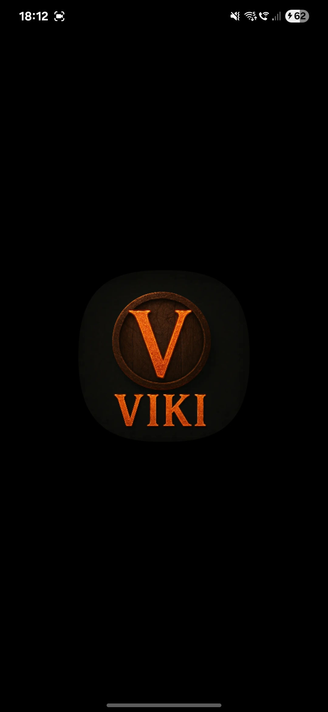

# ValheimVikiApp
<a href="https://buymeacoffee.com/rabbitv" target="_blank"></a>

## 🎥 App Demo
<table>
  <tr>
    <td align="center">
        <sub><b>Valheim Viki Logo</b></sub>
         <br/>
        <br/>
      
    </td>
    <td align="center">
      <sub>🏠 <b>Home</b> — smooth section transitions, animated lists, and polished cards.</sub>
        <br/>
       <br/>
      
    </td>
  </tr>
  <tr>
    <td align="center">
        <sub>🔎 <b>Search</b> — instant queries, and inline results.</sub>
         <br/>
       <br/>
      
    </td>
    <td align="center">
     <sub>🧩 <b>Filters & Sorting</b> — narrow results by category and rarity, adjust sort order.</sub>
      <br/>
       <br/>
      
    </td>
  </tr>
  <tr>
    <td align="center">
      <sub>⭐ <b>Favorites</b> — one-tap add/remove with animations and persisted state.</sub>
      <br/>
       <br/>
      
    </td>
    <td align="center">
      <sub>🦌 <b>Creatures</b> — detailed sheets with stats, descriptions, and drop info.</sub>
       <br/>
       <br/>
      
    </td>
  </tr>
</table>

## 📱 Overview

**ValheimVikiApp** is a fully functional mobile application built in **Kotlin** and **Jetpack
Compose** using the **MVVM architecture pattern**.  
It serves as an extensive, user-friendly companion for the game **Valheim**, providing detailed
information on items, crafting, biomes, creatures, and more — all in a clean, modern UI.

While the app is complete and production-ready, it is **not yet published** on the Google Play
Store.  
A private backend exists for data retrieval, but it is **not publicly accessible**.

---
<a href="https://buymeacoffee.com/rabbitv" target="_blank"></a>
---

## ✨ Features

- **MVVM Architecture** with clean separation of concerns
- **Jetpack Compose UI** for a modern, reactive user interface
- **Offline-friendly** (data can be cached locally)
- **Detailed in-game database** for:
    - Items & crafting recipes
    - Materials & upgrades
    - Biomes & points of interest
    - Creatures & drops
- **Powerful search and filtering**
- **Favorites system** to quickly access frequently used information
- **Smooth animations** and navigation transitions
- **Unit testing** for core features

---

## 🛠️ Tech Stack

**Language & Frameworks**

- [Kotlin](https://kotlinlang.org/)
- [Jetpack Compose](https://developer.android.com/jetpack/compose)
- [Coroutines & Flow](https://kotlinlang.org/docs/coroutines-overview.html)
- [Hilt](https://dagger.dev/hilt/) for dependency injection

**Architecture**

- MVVM (Model-View-ViewModel)
- Repository pattern
- UseCase layer for business logic

**Testing**

- JUnit 5
- Mockito

---

## 📂 Project Structure

```
com.rabbitv.valheimviki/
│
├── data/               # Data sources (local/remote), repositories
├── domain/             # Business logic, use cases, domain models
├── presentation/       # UI layer (Jetpack Compose), ViewModels
├── di/                 # Dependency injection modules
├── utils/              # Utility classes/helpers
└── tests/              # Unit and UI tests
```

---

## 🚀 Getting Started

> **Note:** The backend used by this app is private and not accessible to third parties.  
> You can still build the project, but live data fetching will not work without the backend.

### Prerequisites

- Android Studio **Giraffe** or newer
- JDK 17+
- Gradle (bundled with Android Studio)
- Internet connection (for fetching dependencies)

### Installation

1. Clone the repository:
   ```bash
   git clone https://github.com/DwMichael/ValheimVikiApp.git
   ```
2. Open the project in **Android Studio**.
3. Build and run the app on an emulator or physical device:
   ```bash
   ./gradlew assembleDebug
   ```

---

## 📜 License

```
Copyright (c) 2025 Michał D (RABBITV)

Permission is hereby granted for educational and personal use only.
Commercial use, redistribution, or sublicensing is strictly prohibited
without explicit written permission from the author.

If any part of this code is used in another project (educational or personal),
the author's full name ("Michał D (RABBITV)") must be clearly included in
the project's documentation and/or credits.

THE SOFTWARE IS PROVIDED "AS IS", WITHOUT WARRANTY OF ANY KIND.
```

---

## 📅 Roadmap

- [ ] Publish to Google Play Store
- [ ] Add multi-language support (EN/PL)
- [ ] Expand content database
- [ ] Offline mode improvements
- [ ] Migrate code to Navigation 3
- [ ] Migrate to KMP and IOS app version

---

## 🤝 Contributions

This project is **not accepting pull requests** at this time due to the private backend.  
However, feedback and suggestions are welcome via the Issues tab.

Two briliant man help me with creating data base schema. If not them l would not start this project. Love <3
Check them out 
https://www.linkedin.com/in/jakub-jankowski-pp/
https://github.com/dlisiewicz

---

## 📬 Contact

**Author:** Michał D (RABBITV)
🔗 www.linkedin.com/in/michał-dwernicki-2900b1274  
